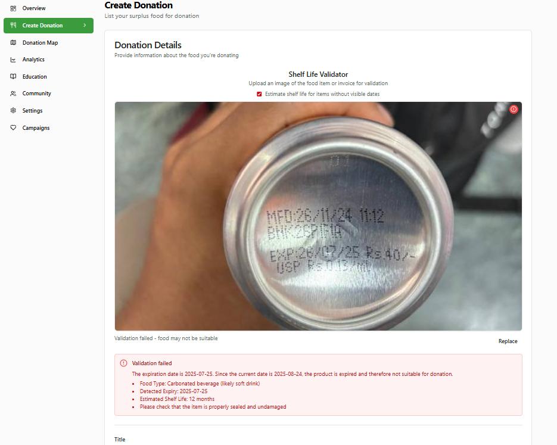
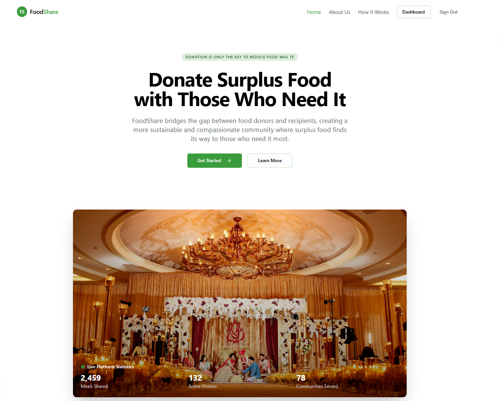
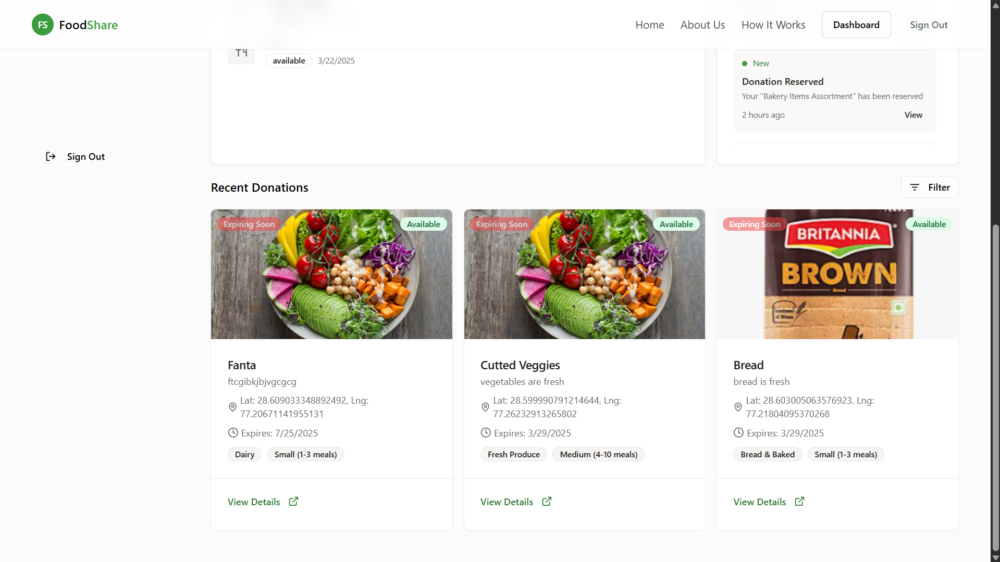
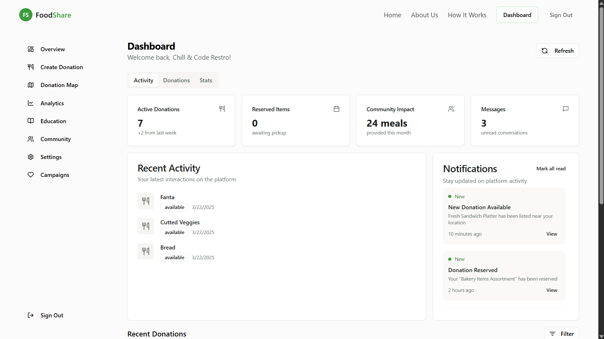

### This Project is for Hackoverflow Hackathon which is a National Level Hackathon.
### Used bun in Frontend
Our Topic is Food Share Website.
Which will help world Save food.
Food wastage is not a small problem but its a global issue. to our come this we have develop a website which minimizes the food wasteage by sharing foods to needy.



<!-- ## How to run this project ????##
- First run frontend then run backend 
To Run Frontend: -->
 <!-- bun install
 bun dev
- Now Run Backend:
 cd backend
 npm install
  npm run dev  -->

## Project Details

Food Share is a web platform designed to minimize food wastage by connecting individuals and organizations with surplus food to those in need. The platform allows users to list excess food, browse available food items, and coordinate pickups or deliveries, fostering a community-driven approach to solving food insecurity.

### Features

- User authentication and role-based access (donor, receiver, admin)
- Post and browse food listings with details and images
- Real-time notifications for new listings and requests
- Location-based search and filtering
- Admin dashboard for managing users and posts

### Preview

#### Home Page


#### Food Listings


#### Admin Dashboard


## Technology Used

- **Frontend:** React.js, Bun.js, Tailwind CSS
- **Backend:** Node.js, Express.js, MongoDB
- **Authentication:** JWT, bcrypt
- **Other:** RESTful APIs, Cloudinary (for image uploads), Socket.io (for notifications)

## How to Run This Project

### Prerequisites

- [Bun](https://bun.sh/) installed
- [Node.js](https://nodejs.org/) and [npm](https://www.npmjs.com/) installed
- [MongoDB](https://www.mongodb.com/) running locally or a MongoDB Atlas account

### Steps

#### 1. Run the Frontend

```bash
bun install
bun dev
```

#### 2. Run the Backend

```bash
cd backend
npm install
npm run dev
```

#### 3. Open the Application

- Frontend: Visit `http://localhost:3000`
- Backend API: Runs on `http://localhost:5000`

> **Note:** Update environment variables as needed in `.env` files for both frontend and backend.
